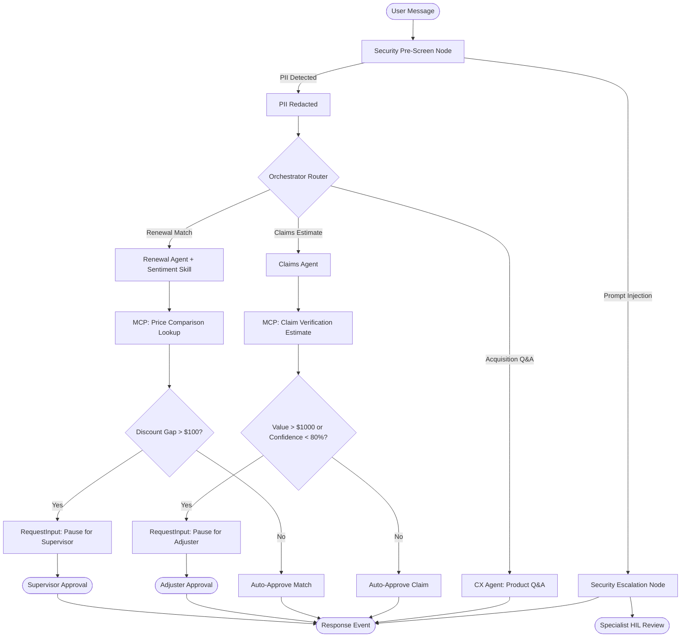

# Strawberry Insurance Agent Gateway

A premium, secure agentic service built with the **Google Agent Development Kit (ADK) 2.0** and FastAPI, featuring multi-agent orchestration, Human-in-the-Loop (HIL) safety gates, sentiment-based churn risk assessment, Model Context Protocol (MCP) tool integrations, and robust security pre-screening.

---

## 📖 The Problem
In digital insurance, customers expect rapid responses to quote comparisons and claim status updates. However, automating these processes exposes the business to two critical risks:
1. **Financial & Compliance Exposure**: Auto-approving unverified competitor matches (e.g., massive discount gaps) or high-value claims without human reviews leads to massive business losses.
2. **Security Vulnerabilities**: Public-facing chat interfaces are targets for **PII leaks** (e.g., credit cards, SSNs) and **Prompt Injection attacks** designed to hijack the model's instructions and force auto-approvals.

---

## 💡 The Solution
Our solution is a secure, multi-agent gateway built using **ADK**. It implements:
*   **Security Pre-Screening**: A guardrail that runs *before* any LLM invocation to scrub PII and redirect prompt injections straight to humans.
*   **Intelligent Routing**: An orchestrator that routes user inputs into separate specialized sub-agent workflows (Acquisition, Renewal, Claims).
*   **Model Context Protocol (MCP)**: Exposes competitor quote seeding and claims validation lookup tables to the agents via stdio transport.
*   **Human-in-the-Loop (HIL) Gates**: Programmatic thresholds embedded in the workflow (e.g., discount gap > $100 or claims > $1000) that pause execution and render interactive supervisor approval panels in the concierge interface.

---

## 📐 Architecture
Below is the visual workflow map demonstrating the security screen, routing orchestrator, sub-agents, and HIL boundaries:



---

## 🛠️ Setup Instructions

### 1. Prerequisites
*   **Python**: Version `3.11` or `3.12`
*   **uv**: Python Package Manager (Install via `pip install uv` or standard installation script)
*   **gcloud SDK**: Optional, for Cloud Run deployment

### 2. Dependencies Installation
Initialize virtual environment and sync packages:
```bash
make install
```
This automatically syncs the packages (including `google-adk`, `fastapi`, `uvicorn`, and `mcp`) declared in `pyproject.toml`.

### 3. Environment Variables (`.env`)
Create a `.env` file in the root directory. **No API keys or secrets are stored in the source code.**
```env
GEMINI_API_KEY="your-gemini-api-key-here"
```

### 4. Running the Local Web Playground (Port 8000)
Run the ADK development web UI:
```bash
make playground
```
Open **[http://127.0.0.1:8000/dev-ui](http://127.0.0.1:8000/dev-ui)** in your browser to inspect workflow traces and trigger executions.

### 5. Running the Gateway and Concierge Page (Port 8080)
Start the production-ready FastAPI gateway server serving the beautiful landing page:
```bash
make run-gateway
```
Open **[http://localhost:8080/](http://localhost:8080/)** to interact with the concierge chat widget. This combines static hosting and agent routing under a single port to eliminate CORS restrictions.

---

## 🧪 Local Evaluation & Grading
We maintain a synthetic evaluation suite to verify agent routing correctness and security containment.

1.  **Generate Traces**: Run the test scenarios and automatically resolve HIL gates:
    ```bash
    make generate-traces
    ```
2.  **Run LLM-as-a-Judge Evaluation**: Score the generated traces based on *Routing Correctness* and *Security Containment* (1-5 scale):
    ```bash
    make grade
    ```
3.  **View Scorecard**: View the generated evaluation details at [scorecard.md](file:///C:/Users/NareshPola/.gemini/antigravity-ide/brain/a30c5d2f-e515-4e19-97d0-90eec8ed1817/scorecard.md).

---

## 🚀 Cloud Run Deployment (Optional)

The application is fully containerized and deployable to Google Cloud Run with an ambient Pub/Sub trigger.

### 1. Build the Docker Image
Configure your project and submit the build using Google Cloud Build:
```bash
# Set active project
gcloud config set project <PROJECT_ID>

# Create Artifact Registry Repository (if not already done)
gcloud artifacts repositories create strawberry-repo \
  --repository-format=docker \
  --location=us-central1 \
  --description="Strawberry Agent repository"

# Submit build
gcloud builds submit --tag us-central1-docker.pkg.dev/<PROJECT_ID>/strawberry-repo/strawberry-agent:latest
```

### 2. Deploy to Cloud Run
```bash
gcloud run deploy strawberry-agent \
  --image=us-central1-docker.pkg.dev/<PROJECT_ID>/strawberry-repo/strawberry-agent:latest \
  --platform=managed \
  --region=us-central1 \
  --allow-unauthenticated \
  --port=8080 \
  --set-env-vars=GEMINI_API_KEY="your-gemini-api-key-here"
```
After completion, copy the Service URL (e.g. `https://strawberry-agent-xyz-uc.a.run.app`).

### 3. Create a Pub/Sub Push Trigger Topic
Allows the agent to act as an event-driven background processor:
```bash
# Create the topic
gcloud pubsub topics create strawberry-topic

# Attach push subscription pointing to the Cloud Run endpoint
gcloud pubsub subscriptions create strawberry-subscription \
  --topic=strawberry-topic \
  --push-endpoint="<CLOUD_RUN_SERVICE_URL>/pubsub" \
  --ack-deadline=60
```
